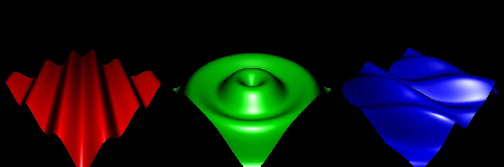
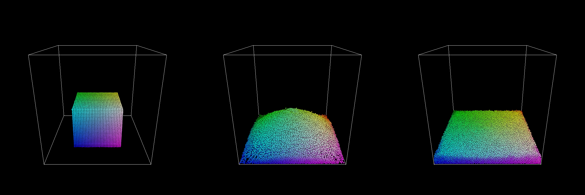
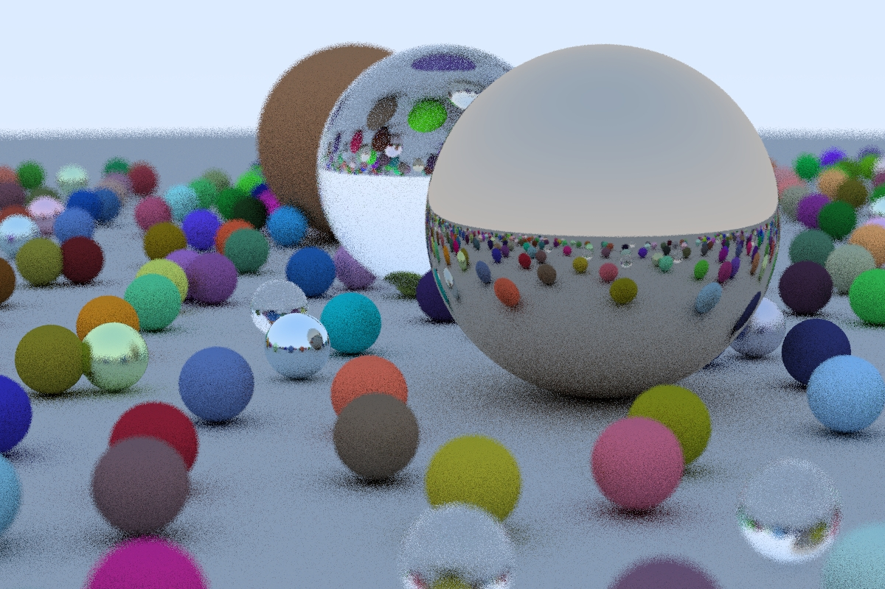
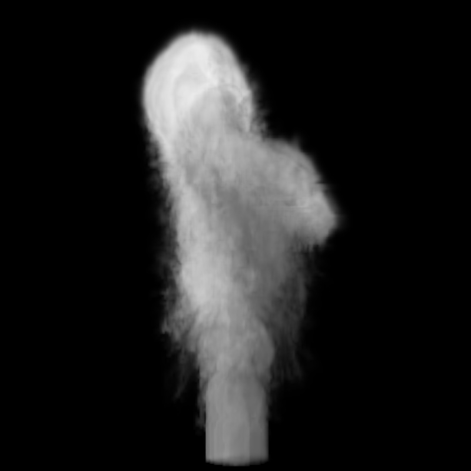
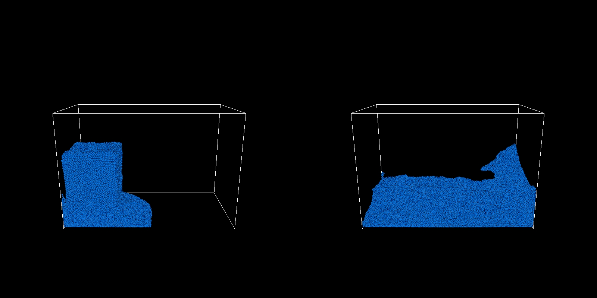
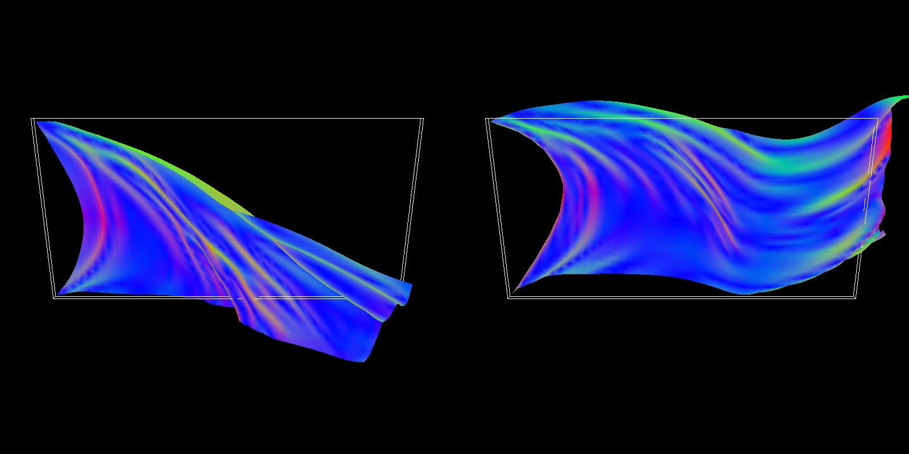
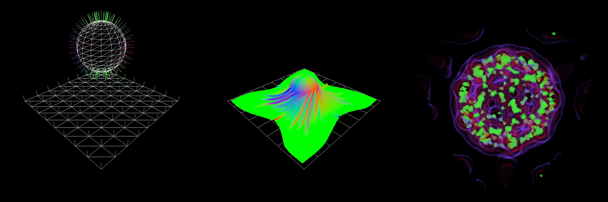

# Daedalus Compute Samples
Tiny collection of compute demos, no wrapper around the compute APIs, tested on Windows/Ubuntu.

## Features
 - ”proof of concept” demos
 - supports OpenGL, OpenCL, CUDA compute shaders/kernels
 - visualization with OpenGL (vbo/tex interop)

## Mesh Deform
<p align="center"></p>

## Cloth Simulation
<p align="center"></p>

## Particle Simulation
<p align="center"></p>

## Ray Tracing in One Weekend by Peter Shirley
<p align="center"></p>

## PBRT ray-marching volume rendering, with single scattering lighting model
<p align="center"></p>

## NVIDIA FleX Demo - DamBreak
<p align="center"></p>

## NVIDIA FleX Demo - FlagCloth
<p align="center"></p>

## OpenGL samples
<p align="center"></p>

## OpenCL platform and deivce info for Intel i7-6770HQ  + Iris Pro Graphics 580
```
PLATFORM #0
CL_PLATFORM_VENDOR:                 Intel(R) Corporation
CL_PLATFORM_NAME:                   Intel(R) OpenCL
CL_PLATFORM_VERSION:                OpenCL 2.1
CL_PLATFORM_PROFILE:                FULL_PROFILE

DEVICE #0
CL_DEVICE_VENDOR:                   Intel(R) Corporation
CL_DEVICE_NAME:                     Intel(R) Iris(R) Pro Graphics 580
CL_DEVICE_VERSION:                  OpenCL 2.1 NEO
CL_DRIVER_VERSION:                  25.20.100.6577
CL_DEVICE_PROFILE:                  FULL_PROFILE
CL_DEVICE_MAX_CLOCK_FREQUENCY:      950
CL_DEVICE_MAX_COMPUTE_UNITS:        72
CL_DEVICE_MAX_WORK_GROUP_SIZE:      256
CL_DEVICE_MAX_WORK_ITEM_SIZES:      256x256x256
CL_DEVICE_EXTENSIONS:
                                    cl_intel_accelerator
                                    cl_intel_advanced_motion_estimation
                                    cl_intel_d3d11_nv12_media_sharing
                                    cl_intel_device_side_avc_motion_estimation
                                    cl_intel_driver_diagnostics
                                    cl_intel_dx9_media_sharing
                                    cl_intel_media_block_io
                                    cl_intel_motion_estimation
                                    cl_intel_packed_yuv
                                    cl_intel_planar_yuv
                                    cl_intel_required_subgroup_size
                                    cl_intel_simultaneous_sharing
                                    cl_intel_spirv_device_side_avc_motion_estimation
                                    cl_intel_spirv_media_block_io
                                    cl_intel_spirv_subgroups
                                    cl_intel_subgroups
                                    cl_intel_subgroups_short
                                    cl_khr_3d_image_writes
                                    cl_khr_byte_addressable_store
                                    cl_khr_create_command_queue
                                    cl_khr_d3d10_sharing
                                    cl_khr_d3d11_sharing
                                    cl_khr_depth_images
                                    cl_khr_dx9_media_sharing
                                    cl_khr_fp16
                                    cl_khr_fp64
                                    cl_khr_gl_depth_images
                                    cl_khr_gl_event
                                    cl_khr_gl_msaa_sharing
                                    cl_khr_gl_sharing
                                    cl_khr_global_int32_base_atomics
                                    cl_khr_global_int32_extended_atomics
                                    cl_khr_icd
                                    cl_khr_il_program
                                    cl_khr_image2d_from_buffer
                                    cl_khr_local_int32_base_atomics
                                    cl_khr_local_int32_extended_atomics
                                    cl_khr_mipmap_image
                                    cl_khr_mipmap_image_writes
                                    cl_khr_priority_hints
                                    cl_khr_spir
                                    cl_khr_subgroups
                                    cl_khr_throttle_hints

DEVICE #1
CL_DEVICE_VENDOR:                   Intel(R) Corporation
CL_DEVICE_NAME:                     Intel(R) Core(TM) i7-6770HQ CPU @ 2.60GHz
CL_DEVICE_VERSION:                  OpenCL 2.1 (Build 0)
CL_DRIVER_VERSION:                  7.6.0.1125
CL_DEVICE_PROFILE:                  FULL_PROFILE
CL_DEVICE_MAX_CLOCK_FREQUENCY:      2600
CL_DEVICE_MAX_COMPUTE_UNITS:        8
CL_DEVICE_MAX_WORK_GROUP_SIZE:      8192
CL_DEVICE_MAX_WORK_ITEM_SIZES:      8192x8192x8192
CL_DEVICE_EXTENSIONS:
                                    cl_intel_dx9_media_sharing
                                    cl_intel_exec_by_local_thread
                                    cl_intel_vec_len_hint
                                    cl_khr_3d_image_writes
                                    cl_khr_byte_addressable_store
                                    cl_khr_d3d11_sharing
                                    cl_khr_depth_images
                                    cl_khr_dx9_media_sharing
                                    cl_khr_fp64
                                    cl_khr_gl_sharing
                                    cl_khr_global_int32_base_atomics
                                    cl_khr_global_int32_extended_atomics
                                    cl_khr_icd
                                    cl_khr_image2d_from_buffer
                                    cl_khr_local_int32_base_atomics
                                    cl_khr_local_int32_extended_atomics
                                    cl_khr_spir
```

## Configure, build and run
```
git clone https://github.com/Woking-34/daedalus-compute.git
cd daedalus-compute
mkdir daedalus-build && cd daedalus-build
cmake .. -G"Visual Studio 15 2017 Win64"
cmake --build . --target comp_deform_gl --config Release
cmake --build . --target comp_cloth_gl --config Release
cmake --build . --target comp_particles_gl --config Release
...

cd ../daedalus-bin/Win64/Release
comp_deform_gl.exe
comp_cloth_gl.exe
comp_particles_gl.exe
...
```

## Todos
 - fix CUDA texture interop fallback path
 - fix rtow OpenCL vc CUDA perf diff

## References
 - [NVIDIA OpenCL SDK - OpenCL Simple OpenGL Interop](https://developer.nvidia.com/opencl)
 - [NVIDIA OpenCL SDK - OpenCL Particle Collision Simulation](https://developer.nvidia.com/opencl)
 - [MMMovania - OpenCloth](https://github.com/mmmovania/opencloth)
 - [Marco Fratarcangeli - GPGPU Cloth simulation using GLSL, OpenCL and CUDA](http://www.cse.chalmers.se/~marcof/publication/geg2011/)
 - [RenderMonkey GLSL velvet shader](https://gpuopen.com/archive/gamescgi/rendermonkey-toolsuite/)
 - [petershirley - raytracinginoneweekend](https://github.com/petershirley/raytracinginoneweekend)
 - [rogerallen - raytracinginoneweekendincuda](https://github.com/rogerallen/raytracinginoneweekendincuda)
 - [ISPC examples - volume_rendering](https://github.com/ispc/ispc/tree/master/examples/volume_rendering)
 - [NVIDIA GameWorks - FleX](https://developer.nvidia.com/flex)
