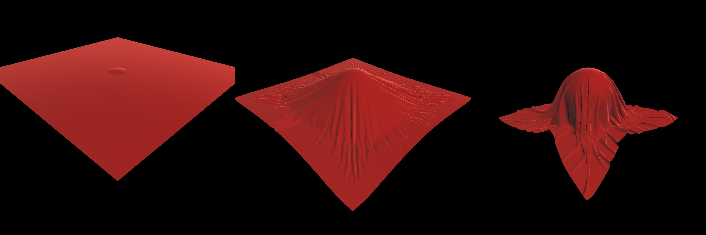

# Daedalus Compute Samples
Tiny collection of compute demos, no wrapper around the compute APIs, tested on Windows/Ubuntu.

## Features
 - ”proof of concept” demos
 - supports OpenGL, OpenCL, CUDA compute shaders/kernels
 - visualization with OpenGL (vbo interop)

## Mesh Deform
<p align="center"></p>

## Cloth Simulation
<p align="center"></p>

## Particle Simulation
<p align="center"></p>

## References
 - [NVIDIA OpenCL SDK - OpenCL Simple OpenGL Interop](https://developer.nvidia.com/opencl)
 - [NVIDIA OpenCL SDK - OpenCL Particle Collision Simulation](https://developer.nvidia.com/opencl)
 - [MMMovania - OpenCloth](https://github.com/mmmovania/opencloth)
 - [Marco Fratarcangeli - GPGPU Cloth simulation using GLSL, OpenCL and CUDA](http://www.cse.chalmers.se/~marcof/publication/geg2011/)
 - [RenderMonkey GLSL velvet shader](https://gpuopen.com/archive/gamescgi/rendermonkey-toolsuite/)

## Compile and build
```
git clone https://github.com/Woking-34/daedalus-compute.git
cd daedalus-compute
mkdir daedalus-build
cd daedalus-build
cmake .. -G"Visual Studio 15 2017 Win64"
cmake --build . --target comp_deform_gl --config Release
cmake --build . --target comp_cloth_gl --config Release
cmake --build . --target comp_particles_gl --config Release
...
```
